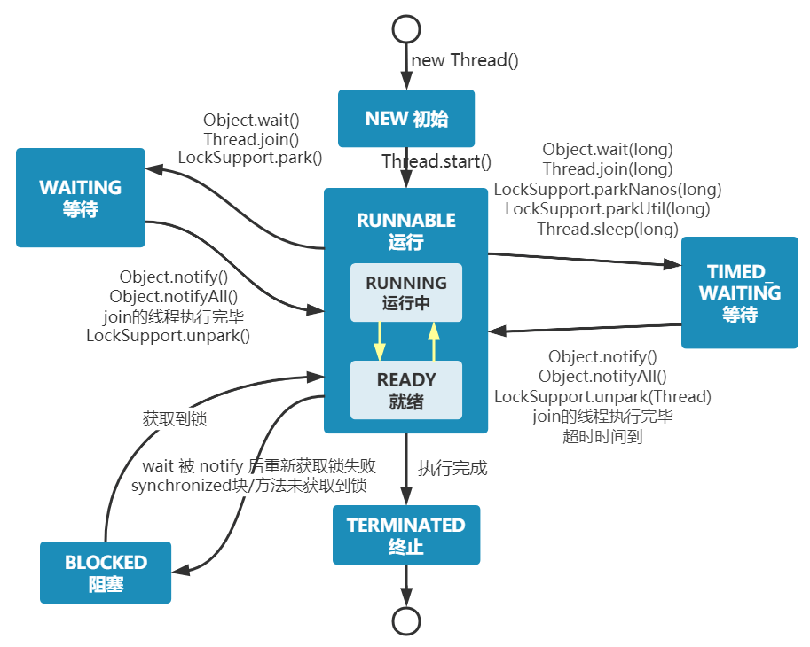

何为进程?<br />
进程是程序的一次执行过程，是系统运行程序的基本单位，因此进程是动态的。<br />
系统运行一个程序即是一个进程从创建，运行到消亡的过程。<br />
在 Java 中，当我们启动 main 函数时其实就是启动了一个 JVM 的进程，<br />
而 main 函数所在的线程就是这个进程中的一个线程，也称主线程。<br />
何为线程?<br />
线程是进程的一个执行单元，也是进程内科调度和分派的基本单位，它是比进程更小的能独立运行的基本单位。<br />
```java
public class MultiThread {
public static void main(String[] args) {
// 获取 Java 线程管理 MXBean
ThreadMXBean threadMXBean = ManagementFactory.getThreadMXBean();
// 不需要获取同步的 monitor 和 synchronizer 信息，仅获取线程和线程堆栈信息
ThreadInfo[] threadInfos = threadMXBean.dumpAllThreads(false, false);
// 遍历线程信息，仅打印线程 ID 和线程名称信息
for (ThreadInfo threadInfo : threadInfos) {
System.out.println("[" + threadInfo.getThreadId() + "] " + threadInfo.getThreadName());
}
}
}
```

------


<br />
从上图可以看出：一个进程中可以有多个线程，<br />多个线程共享进程的堆和方法区 (JDK1.8 之后的元空间)资源，<br />
但是每个线程有自己的程序计数器、虚拟机栈 和 本地方法栈。总结： 线程是进程划分成的更小的运行单位。<br />
线程和进程最大的不同在于基本上各进程是独立的，而各线程则不一定，因为同一进程中的线程极有可能会相互影响。<br />
线程执行开销小，但不利于资源的管理和保护；而进程正相反。下面是该知识点的扩展内容！<br />
下面来思考这样一个问题：<br />
为什么程序计数器、虚拟机栈和本地方法栈是线程私有的呢？<br />
为什么堆和方法区是线程共享的呢？程序计数器为什么是私有的?<br />
程序计数器为什么是私有的?<br />
>>程序计数器主要有下面两个作用：字节码解释器通过改变程序计数器来依次读取指令，从而实现代码的流程控制，<br />
如：顺序执行、选择、循环、异常处理。在多线程的情况下，程序计数器用于记录当前线程执行的位置，<br />
从而当线程被切换回来的时候能够知道该线程上次运行到哪儿了。需要注意的是，如果执行的是 native 方法，<br />
那么程序计数器记录的是 undefined 地址，只有执行的是 Java 代码时程序计数器记录的才是下一条指令的地址。<br />
所以，程序计数器私有主要是为了线程切换后能恢复到正确的执行位置。<br />
**虚拟机栈和本地方法栈为什么是私有的?**
>>虚拟机栈： 每个 Java 方法在执行之前会创建一个栈帧用于存储局部变量表、操作数栈、常量池引用等信息。<br />
> 从方法调用直至执行完成的过程，就对应着一个栈帧在 Java 虚拟机栈中入栈和出栈的过程。<br />
> 本地方法栈： 和虚拟机栈所发挥的作用非常相似，<br />
> 区别是：<br />
> 虚拟机栈为虚拟机执行 Java 方法 （也就是字节码）服务，而本地方法栈则为虚拟机使用到的 Native 方法服务。 <br />
> 在 HotSpot 虚拟机中和 Java 虚拟机栈合二为一。<br />
> 所以，为了保证线程中的局部变量不被别的线程访问到，虚拟机栈和本地方法栈是线程私有的。<br />
> 一句话简单了解堆和方法区堆和方法区是所有线程共享的资源，其中堆是进程中最大的一块内存，<br />
> 主要用于存放新创建的对象 (几乎所有对象都在这里分配内存)，<br />
> 方法区主要用于存放已被加载的类信息、常量、静态变量、即时编译器编译后的代码等数据。<br />

------
**Thread#sleep() 方法和 Object#wait() 方法对比**<br />
共同点：两者都可以暂停线程的执行。<br />
区别：<br />
sleep() 方法没有释放锁，而 wait() 方法释放了锁 。<br />
wait() 通常被用于线程间交互/通信，sleep()通常被用于暂停执行。<br />
wait() 方法被调用后，线程不会自动苏醒，需要别的线程调用同一个对象上的 notify()或者 notifyAll() 方法。<br />
sleep()方法执行完成后，线程会自动苏醒，或者也可以使用 wait(long timeout) 超时后线程会自动苏醒。<br />
sleep() 是 Thread 类的静态本地方法，wait() 则是 Object 类的本地方法。为什么这样设计呢？下一个问题就会聊到。<br />


-----
**可以直接调用 Thread 类的 run 方法吗？**<br />
>> 这是另一个非常经典的 Java 多线程面试问题，而且在面试中会经常被问到。很简单，但是很多人都会答不上来！<br />
new 一个 Thread，线程进入了新建状态。调用 start()方法，会启动一个线程并使线程进入了就绪状态，<br />
当分配到时间片后就可以开始运行了。 start() 会执行线程的相应准备工作，然后自动执行 run() 方法的内容，这是真正的多线程工作。 <br />
但是，直接执行 run() 方法，会把 run() 方法当成一个 main 线程下的普通方法去执行，并不会在某个线程中执行它，<br />
所以这并不是多线程工作。总结：调用 start() 方法方可启动线程并使线程进入就绪状态，直接执行 run() 方法的话不会以多线程的方式执行。<br />

-----

**为什么 wait() 方法不定义在 Thread 中？**<br />
>> wait() 是让获得对象锁的线程实现等待 会自动释放当前线程占有的对象锁 每个对象都拥有对象锁 <br />
>> 既然要释放对前的对象锁并让其进入 WAITING 状态 自然要操作对应的对象（Object）而非当前的线程 （Thread）<br />
**类似的问题：为什么 sleep() 方法定义在 Thread 中？**<br />
>>因为 sleep() 是让当前线程暂停执行，不涉及到对象类，也不需要获得对象锁。<br />
-----

------



⭐️**说说线程的生命周期和状态?<br />**
Java 线程在运行的生命周期中的指定时刻只可能处于下面 6 种不同状态的其中一个状态：<br />
NEW: 初始状态，线程被创建出来但没有被调用 start() 。<br />
RUNNABLE: 运行状态，线程被调用了 start()等待运行的状态。<br />
BLOCKED：阻塞状态，需要等待锁释放。<br />
WAITING：等待状态，表示该线程需要等待其他线程做出一些特定动作（通知或中断）。<br />
TIME_WAITING：超时等待状态，可以在指定的时间后自行返回而不是像 WAITING 那样一直等待。<br />
TERMINATED：终止状态，表示该线程已经运行完毕。<br />

Thread 类 API：

| 方法                                        | 说明                                                         |
| ------------------------------------------- | ------------------------------------------------------------ |
| public void start()                         | 启动一个新线程体，Java虚拟机调用此线程的 run 方法              |
| public void run()                           | 线程启动后调用该方法                                         |
| public void setName(String name)            | 给当前线程取名字                                             |
| public void getName()                       | 获取当前线程的名字<br />线程存在默认名称：子线程是 Thread-索引，主线程是 main |
| public static Thread currentThread()        | 获取当前线程对象，代码在哪个线程中执行                       |
| public static void sleep(long time)         | 让当前线程休眠多少毫秒再继续执行<br />**Thread.sleep(0)** : 让操作系统立刻重新进行一次 CPU 竞争 |
| public static native void yield()           | 提示线程调度器让出当前线程对 CPU 的使用                      |
| public final int getPriority()              | 返回此线程的优先级                                           |
| public final void setPriority(int priority) | 更改此线程的优先级，常用 1 5 10                              |
| public void interrupt()                     | 中断这个线程，异常处理机制                                   |
| public static boolean interrupted()         | 判断当前线程是否被打断，清除打断标记                         |
| public boolean isInterrupted()              | 判断当前线程是否被打断，不清除打断标记                       |
| public final void join()                    | 等待这个线程结束                                             |
| public final void join(long millis)         | 等待这个线程死亡 millis 毫秒，0 意味着永远等待               |
| public final native boolean isAlive()       | 线程是否存活（还没有运行完毕）                               |
| public final void setDaemon(boolean on)     | 将此线程标记为守护线程或用户线程                             |
***


#### run start

run：称为线程体，包含了要执行的这个线程的内容，方法运行结束，此线程随即终止。<br />
直接调用 run 是在主线程中执行了 run，没有启动新的线程，需要顺序执行<br />

start：使用 start 是启动新的线程，此线程处于就绪（可运行）状态，通过新的线程间接执行 run 中的代码<br />

说明：**线程控制资源类**<br />

run() 方法中的异常不能抛出，只能 try/catch<br />

* 因为父类中没有抛出任何异常，子类不能比父类抛出更多的异常<br />
* **异常不能跨线程传播回 main() 中**，因此必须在本地进行处理<br />

**java 有几种方式创建线程？**<br />
• ①继承Thread类；<br />

• ②实现Runnable接口；<br />

• ③实现Callable接口；<br />

• ④使用ExecutorService线程池；<br />

• ⑤使用CompletableFuture类；<br />

• ⑥基于ThreadGroup线程组；<br />

• ⑦使用FutureTask类；<br />

• ⑧使用匿名内部类或Lambda表达式；<br />

• ⑨使用Timer定时器类；<br />

• ⑩使用ForkJoin线程池或Stream并行流。<br />

继承Thread类 重写 run 方法<br />

```java
public class ExtendsThread extends Thread {
	@Override
	public void run() {
		System.out.println(Thread.currentThread().getName() + "......");
	}
	public static void main(String[] args) {
		new ExtendsThread().start();
	}
}
```

实现Runable接口 重写 run 方法<br />
```java
public class ImplementsRunnable implements Runnable {
	@Override
	public void run() {
		System.out.println("2......");
	}

	public static void main(String[] args) {
		ImplementsRunnable runnable = new ImplementsRunnable();
		new Thread(runnable).start();
	}
}
```

实现Callable接口<br />
和上一种方式类似，只不过这种方式可以拿到线程执行完的返回值，如下：<br />
```java
public class ImplementsCallable implements Callable<String> {
@Override
public String call() throws Exception {
  System.out.println("3......");
  return "zhuZi";
}

    public static void main(String[] args) throws Exception {
        ImplementsCallable callable = new ImplementsCallable();
        FutureTask<String> futureTask = new FutureTask<>(callable);
        new Thread(futureTask).start();
        System.out.println(futureTask.get());
    }
}
```
实现Callable接口<br />
```java
public class ThreadDemoByCallable implements Callable<String>{

	@Override
	public String call() throws Exception {
		return Thread.currentThread().getName() + "->" + "Hello World";
	}
	public static void main(String[] args) {
		ThreadDemoByCallable call = new ThreadDemoByCallable();
		FutureTask<String> task = new FutureTask<>(call);
		Thread t = new Thread(task);
		t.start();
		try {
			String s = task.get(); // 获取call方法返回的结果（正常/异常结果）
			System.out.println(s);
		}  catch (Exception e) {
			e.printStackTrace();
		}
	}
}
```
使用ExecutorService线程池<br />
```java
public class UseExecutorService {
	public static void main(String[] args) {
		ExecutorService poolA = Executors.newFixedThreadPool(2);
		poolA.execute(()->{
			System.out.println("4A......");
		});
		poolA.shutdown();

		// 又或者自定义线程池
		ThreadPoolExecutor poolB = new ThreadPoolExecutor(2, 3, 0,
				TimeUnit.SECONDS, new LinkedBlockingQueue<Runnable>(3),
				Executors.defaultThreadFactory(), new ThreadPoolExecutor.AbortPolicy());
		poolB.submit(()->{
			System.out.println("4B......");
		});
		poolB.shutdown();
	}
}
```

**1.5、使用CompletableFuture类**<br />
>>CompletableFuture是JDK1.8引入的新类，可以用来执行异步任务，如下：
```java
public class UseCompletableFuture {
public static void main(String[] args) throws InterruptedException {
CompletableFuture<String> cf = CompletableFuture.supplyAsync(() -> {
System.out.println("5......");
return "zhuZi";
});
// 需要阻塞，否则看不到结果
Thread.sleep(1000);
}
}
```


**1.6、基于ThreadGroup线程组**<br />
>>Java线程可以分组，可以创建多条线程作为一个组，如下：<br />
```java
public class UseThreadGroup {
public static void main(String[] args) {
ThreadGroup group = new ThreadGroup("groupName");

        new Thread(group, ()->{
            System.out.println("6-T1......");
        }, "T1").start();

        new Thread(group, ()->{
            System.out.println("6-T2......");
        }, "T2").start();

        new Thread(group, ()->{
            System.out.println("6-T3......");
        }, "T3").start();
    }
}
```

**1.7、使用FutureTask类**<br />
>>这个和之前实现Callable接口的方式差不多，只不过用匿名形式创建Callable，如下：
```java
public class UseFutureTask {
public static void main(String[] args) {
FutureTask<String> futureTask = new FutureTask<>(() -> {
System.out.println("7......");
return "zhuZi";
});
new Thread(futureTask).start();
}
}
```

**1.8、使用匿名内部类或Lambda**<br />
>>这种方式属于硬扯，就是直接new前面所说的Runnable接口， 那你有病啊还写？？？ 或者通过Lambda表达式书写，如下：
```java
public class UseAnonymousClass {
public static void main(String[] args) {
new Thread(new Runnable() {
@Override
public void run() {
System.out.println("8A......");
}
}).start();

        new Thread(() -> 
                System.out.println("8B......")
        ).start();
    }
}
```

**1.9、使用Timer定时器类**<br />
>>在JDK1.3时，曾引入了一个Timer类，用来执行定时任务，如下：
```java
public class UseTimer {
public static void main(String[] args) {
Timer timer = new Timer();

        timer.schedule(new TimerTask() {
            @Override
            public void run() {
                System.out.println("9......");
            }
        }, 0, 1000);
    }
}
//里面需要传入两个数字，第一个代表启动后多久开始执行，第二个代表每间隔多久执行一次，单位是ms毫秒。
```

**1.10、使用ForkJoin或Stream并行流**<br />
>>ForkJoin是JDK1.7引入的新线程池，基于分治思想实现。而后续JDK1.8的parallelStream并行流，默认就基于ForkJoin实现，如下：
```java
public class UseForkJoinPool {
	public static void main(String[] args) {
		ForkJoinPool forkJoinPool = new ForkJoinPool();
		forkJoinPool.execute(() -> {
			System.out.println("10A......");
		});

		List<String> list = Arrays.asList("10B......");
		list.parallelStream().forEach(System.out::println);
	}
}
```


“Java有几种方式创建线程？”<br />

出现的答案，最少都有四种，那这真的对吗？可以说对，但严格意义上来说，又不对。<br />

抛开后面一些先不谈，咱们就聊最开始的三种：“继承Thread类、实现Runnable接口、实现Callable接口”，<br />
这应该是广为人知的答案，不管是刚入行的小白，还是在业内深耕已久的老鸟，相信都背过这一道八股文。<br />

那么此时来看个例子：<br />
```java
public class ImplementsRunnable implements Runnable {
@Override
public void run() {
System.out.println(Thread.currentThread().getName()
+ "：竹子爱熊猫");
}
}
```

这里定义了一个类，实现了Runnable接口并重写了run方法，按前面的说法，这种方式是不是创建了一条线程？<br />
答案是Yes，可问题来了，请你告诉我，该如何启动这条所谓的“线程”呢？<br />
```html
public static void main(String[] args) {
		ImplementsRunnable runnable = new ImplementsRunnable();
		runnable.run();
		}
```
------
难道像上面这样嘛？来看看运行结果：<br />
```html
main：竹子爱熊猫
```
结果很显然，打印出的线程名字为：main，代表目前是主线程在运行，和调用普通方法没任何区别，那究竟该如何创建一条线程呀？要这样做：<br />
```html
public static void main(String[] args) {
ImplementsRunnable runnable = new ImplementsRunnable();
new Thread(runnable).start();
}
```

先new出Runnable对象，接着再new一个Thread对象，然后把Runnable丢给Thread，接着调用start()方法，<br />
此时才能真正意义上创建一条线程，运行结果如下：<br />
```html
Thread-0：竹子爱熊猫

```
此时线程名字变成了Thread-0，这意味着输出“竹子爱熊猫”这句话的代码，并不是main线程在执行了，所以聊到这里，<br />
大家明白我想表达的含义了嘛？实现了Runnable接口的ImplementsRunnable类，并不能被称为一条线程，<br />
包括所谓的Callable、FutureTask……，都不能创建出真正的线程。<br />

换到前面所提出的三种方式中，只有继承Thread类，才能真正创建一条线程，如下：<br />
```html
public class ExtendsThread extends Thread {
@Override
public void run() {
System.out.println(Thread.currentThread().getName()
+ "：竹子爱熊猫");
}

    public static void main(String[] args) {
        new ExtendsThread().start();
    }
}
```


// 运行结果：
//      Thread-0：竹子爱熊猫
因为当你用一个类，继承Thread类时，它内部所有的方法，都会被继承过来，所以当前类可以直接调用start()方法启动，<br />
更具体点来说，在Java中，创建线程的方式就只有一种：调用Thread.start()方法！只有这种形式，才能在真正意义上创建一条线程！<br />

而例如ExecutorService线程池、ForkJoin线程池、CompletableFuture类、Timer定时器类、parallelStream并行流……，<br />
如果有去看过它们源码的小伙伴应该清楚，它们最终都依赖于Thread.start()方法创建线程。<br />

好了，搞清楚这点之后，再回头来看Runnable、Callable，这俩既然不是创建线程的方式，那它们究竟是什么？这点咱们放到后面去讨论，<br />
先来聊聊“Java有三种创建线程的方式”，这个以讹传讹的八股文，到底是怎么来的呢？<br />

究根结底，这个错误观念的源头，来自于《Java编程思想》（《Thinking In Java》）和《Java核心技术》（《Core Java》）这两本书。<br />在《Core Java》这本书的第12、13章，专门对多线程编程进行了讲解，提到了四种创建线程的方式：
<br />
• ①继承Thread类，并重写run()方法；<br />

• ②实现Runnable接口，并传递给Thread构造器；<br />

• ③实现Callable接口，创建有返回值的线程；<br />

• ④使用Executor框架创建线程池。<br />

同样的内容，在《Thinking In Java》的第二十一章，也有重复提及到。<br />于是，国内阅读过这两本书籍的人，在写文章、写面试题、写书籍、授课、录视频……时，把这个概念越传越泛，按照“三人成虎”原则，Java有3、4种创建线程的方式，这个观念变成了事实，从此刻在了每个Java开发者的DNA里。

------
好了，搞清楚问题的缘由，咱们回到前面提出的问题，既然实现Runnable、Callable接口，不是创建线程的方式，那它们究竟是什么？准确来说，这是两种创建“线程体”的方式，包括继承Thread类重写run()方法也是。

看完这个回答，相信大家就能明白“线程体”是怎么一回事了，说简单点，线程是一个独立的执行单元，可以被操作系统调度；<br />
而线程体仅仅只是一个任务，就类似于一段普通的代码，需要线程作为载体才能运行，<br />
ChatGPT给出的总结特别对：线程是执行线程体的容器，线程体是一个可运行的任务。<br />

不过Java中创建线程体的方式，可以基于Runnable创建，也可以靠Callable创建带返回的、也可以通过Timer创建支持定时的……，<br />
但不管是哪种方式，到最后都是依赖于Runnable这个类实现的，如果大家有去研究过Callable的原理，<br />
大家就会发现：**Callable实际上就是Runnable的封装体**。<br />

到这里，搞清线程与线程体的关系后，相信大家就一定明白了我为何说：<br />
Java中创建线程只有Thread.start()这一种方式的原因了！而最开始给出的其他方式，要么是在封装Thread.start()，<br />
要么是在创建线程体，而这个所谓的线程体，更接地气的说，应该是“多线程任务”。<br />

```html
new Runnable(...);
new Callable(...);
```
这并不是在创建线程，而是创建了两个可以提供给线程执行的“多线程任务”。<br />

不过还有个问题，任务和线程，到底是怎么产生绑定关系的呢？大家可以去看Thread类提供的构造器，应该会发现这个构造函数：<br />
```html
public Thread(Runnable target) {
    init(null, target, "Thread-" + nextThreadNum(), 0);
}
```
当new``Thread对象并传入一个任务时，内部会调用init()方法，把传入的任务target传进去，同时还会给线程起个默认名字，<br />
即Thread-x，这个x会从0开始（线程名字也可以自定义）。<br />

而当大家去尝试继续跟进init()方法时，会发现它在做一系列准备工作，如安全检测、设定名称、绑定线程组、设置守护线程……，<br />
当init()方法执行完成后，就可以调用Thread.start()方法启动线程啦。<br />

启动线程时，最终会调用到start0()这个JNI方法，转而会去调用JVM的本地方法，即C/C++所编写的方法，源码我就不带着大家去跟了，<br />
感兴趣的可以去down一下OpenJDK的源码，或者去搜一下Thread.start()的实现原理，我这里就大致总结一下大体过程。<br />

①Thread在类加载阶段，就会通过静态代码块去绑定Thread类方法与JVM本地方法的关系：<br />
```html
private static native void registerNatives();
static {
    registerNatives();
}
```
执行完这个registerNatives()本地方法后，Java的线程方法，就和JVM方法绑定了，如start0()这个方法，<br />
会对应着JVM_StartThread()这个C++函数等（具体代码位于openjdk\jdk\src\share\native\java\lang\Thread.c这个文件）。<br />

②当调用Thread.start()方法后，会先调用Java中定义的start0()，<br />
接着会找到与之绑定的JVM_StartThread()这个JVM函数执行（具体实现位于openjdk\hotspot\src\share\vm\prims\jvm.cpp这个文件）。<br />

③JVM_StartThread()函数最终会调用os::create_thread(...)这个函数，<br />
这个函数依旧是JVM函数，毕竟Java要实现跨平台特性，而不同操作系统创建线程的内核函数，也有所差异，<br />
如Linux操作系统中，创建线程最终会调用到pthread_create(...)这个内核函数。<br />

④创建出一条内核线程后，接着会去执行Thread::start(...)函数，<br />
接着会去执行os::start_thread(thread)这个函数，这一步的作用，主要是让Java线程，<br />
和内核线程产生映射关系，也会在这一步，把Runnable线程体，顺势传递给OS的内核线程<br />
（具体实现位于openjdk\hotspot\src\share\vm\runtime\Thread.cpp这个文件）。<br />

⑤当Java线程与内核线程产生映射后，接着就会执行载入的线程体（线程任务），也就是Java程序员所编写的那个run()方法。<br />